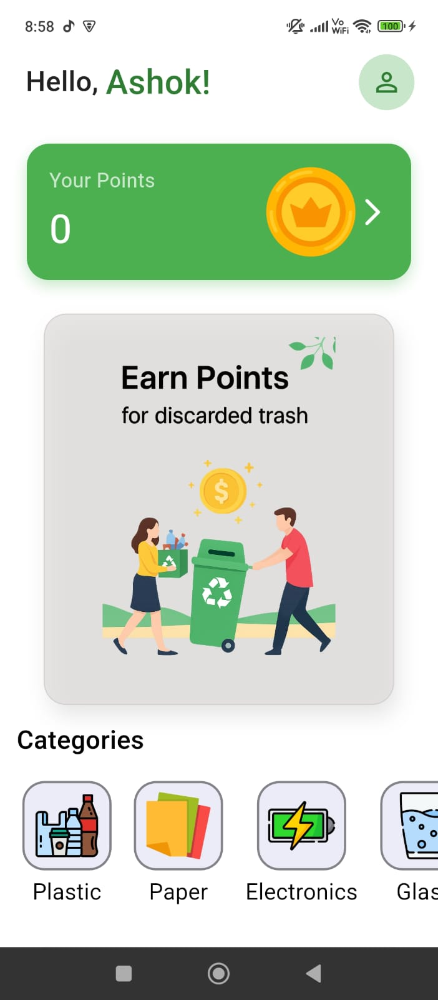

# Sortify - Turn Trash into Treasure! ♻️

Sortify is a Flutter-based mobile application designed to connects users with recyclers, making waste collection quick and hassle-free. It provides an easy-to-use platform for users to schedule pickups for their recyclable waste and earn reward points, which can be redeemed for real money via UPI.

---

## 🎯 The Problem It Solves

In many urban areas, improper waste segregation and the lack of incentives for recycling lead to overflowing landfills and environmental pollution. Sortify addresses this by:
* **Incentivizing Recycling:** By offering tangible rewards (points redeemable for cash), the app motivates users to segregate and recycle their waste properly.
* **Organizing Waste Collection:** It provides a structured system for users to list their recyclable items and schedule pickups, making the process efficient for both users and collectors.
* **Promoting a Circular Economy:** By ensuring that recyclable materials are collected and processed, Sortify contributes to a more sustainable, circular economy.

---

## ✨ Key Features

* **User Authentication:** Secure signup and login functionality using Firebase.
* **Waste Item Listing:** Users can easily list items for pickup by uploading an image, specifying the quantity, and setting a pickup location.
* **Points & Rewards System:** Users are credited with points upon successful verification of their waste items by an admin.
* **Admin Verification System:** A dedicated admin panel to approve or reject waste collection and redemption requests.
* **UPI Redemption:** A seamless process for users to redeem their earned points directly to their bank account via UPI.

---

## 📱 App Screens & Flow

### User Flow

The user journey is designed to be simple and rewarding.

| Onboarding | Signup / Login | Home |
| :---: | :---: | :---: |
| <br> | <br> | <br> |
| **Upload Items** | **Rewards Corner** | **Profile Page** |
| <br> | <br> | <br> |

### Admin Flow

The admin panel is straightforward, allowing for quick verification and approval of user requests.

| Item Approval | Redeem Request Approval |
| :---: | :---: |
| <br> | <br> |

---

## 🛠️ Tech Stack & Architecture

* **Framework:** Flutter
* **Backend & Database:** Firebase
    * **Firestore:** Used as the primary database for storing user data, pickup requests, and transaction history.
    * **Firebase Storage:** Used for uploading and storing images of waste items submitted by users.
    * **Firebase Authentication:** Handles user signup and login.
* **State Management:** `setState` / Provider (or your chosen method)

---

## 📂 Project Structure

The project follows a standard Flutter application structure to maintain a clean and scalable codebase.
```
sortify/
├── android
├── build
├── images/        
├── ios
├── lib
│   ├── Admin
│   │   ├── admin_approval.dart
│   │   └── admin_redeem.dart
│   ├── pages
│   │   ├── onboarding.dart
│   │   ├── signup.dart
│   │   ├── home.dart
│   │   ├── upload_item.dart
│   │   ├── points.dart
│   │   ├── profile.dart   
│   ├── services
│   │   ├── auth.dart
│   │   ├── database.dart
│   │   ├── shared_pref.dart
│   │   └── widget_support.dart
│   └── main.dart
├── ... (other project folders)
├── pubspec.yaml
└── README.md
```
---
## ✅ Fulfilling Project Requirements

This project was built to meet the following specific requirements:

* **Open-Source & Platform:** The app is fully open-source, built from scratch using **Flutter**, and the code is available on this GitHub repository.
* **Time Dedication:** Over **30 hours** have been dedicated to the planning, development, and testing of this application.
* **Progress Logging:** Progress has been logged using **hackatime** as required.
* **Real Problem:** The app addresses the real-world problem of inefficient waste management and lack of recycling incentives.
* **Unique Screens:** The app includes more than five unique screens: Onboarding, Signup/Login, Home, Upload Items, Rewards, and Profile, plus two dedicated screens for the admin panel.
* **Core Features:** The app is built around three core, cohesive features:
    1.  **Waste Listing & Scheduling:** The primary feature allowing users to submit items.
    2.  **Points & Rewards Engine:** The system for crediting and managing user points.
    3.  **Admin Verification System:** The backend workflow that ensures the integrity of the system.
* **Data Management:** The app uses **Firebase (Firestore and Storage)** as its cloud-based data management system.
* **Advanced Features:** The project integrates with the Firebase suite, a comprehensive backend service, to handle authentication, database, and file storage.
* **Clean, User-Friendly Design:** The UI is designed to be intuitive, visually appealing, and easy to navigate, ensuring a positive user experience.

---

## 🚀 Getting Started

To get a local copy up and running, follow these simple steps.

### Prerequisites

* Flutter SDK installed
* A configured Firebase project

### Installation

1.  **Clone the repo**
    ```sh
    git clone [https://github.com/your_username/sortify.git](https://github.com/your_username/sortify.git)
    ```
2.  **Navigate to the project directory**
    ```sh
    cd sortify
    ```
3.  **Install packages**
    ```sh
    flutter pub get
    ```
4.  **Setup Firebase**
    * Download your `google-services.json` file from your Firebase project console.
    * Place it inside the `android/app/` directory.
5.  **Run the app**
    ```sh
    flutter run
    ```

---
